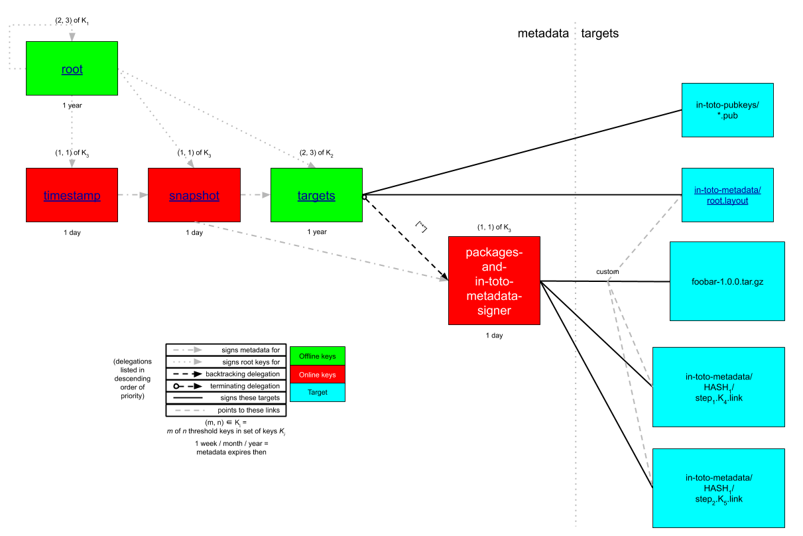
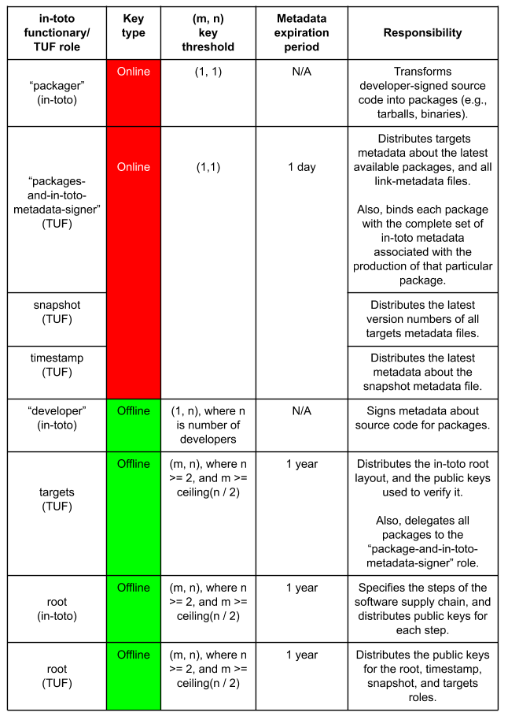
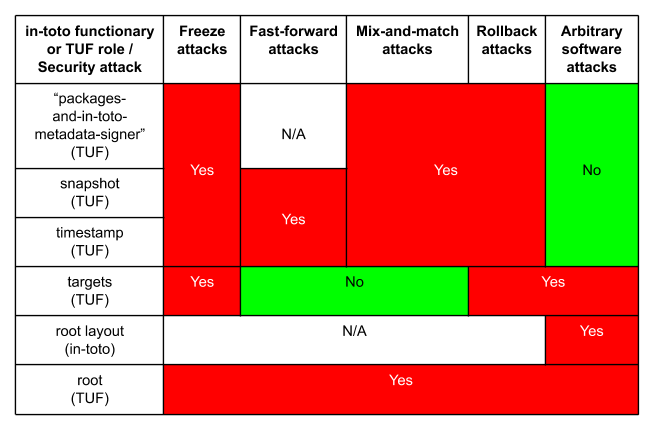

= ITE-2: A general overview of combining TUF and in-toto to build compromise-resilient CI/CD
:source-highlighter: pygments
:toc: preamble
:toclevels: 5
ifdef::env-github[]
:tip-caption: :bulb:
:note-caption: :information_source:
:important-caption: :heavy_exclamation_mark:
:caution-caption: :fire:
:warning-caption: :warning:
endif::[]

.Metadata
[cols="2"]
|===
| ITE
| 2

| Title
| A general overview of combining TUF and in-toto to build compromise-resilient CI/CD

| Sponsor
| link:https://github.com/trishankatdatadog[Trishank Karthik Kuppusamy]

| Status
| Accepted 

| Type
| Informational

| Created
| 2019-07-15

|===

[[abstract]]
== Abstract

We discuss a standard for using The Update Framework (TUF) as a
higher-level protocol for securely distributing in-toto layout and link
metadata as well as the software packages described in the in-toto
metadata. Assuming that critical signing keys are kept offline from the
CI/CD pipeline, combining TUF with in-toto provides the pipeline with a
desirable property called _compromise-resilience_: that is, even if the
pipeline is compromised anywhere between developers and end-users, then
attackers should not be able to cause end-users to install malicious
versions of packages that were never released by developers.

[[motivation-and-reasoning]]
== Motivation and reasoning

Whereas in-toto provides end-to-end verification of a software supply
chain, it does not solve a crucial problem that arises in practice: how
to securely distribute, revoke, and replace the public keys used to
verify the in-toto layout. This mechanism in and of itself SHOULD also be
_compromise-resilient_, and resistant to a compromise of the software
repository or server used to serve files.

While SSL / TLS protects users from man-in-the-middle (MitM) attacks, it is not
compromise-resilient, because attackers who compromise the repository can simply
switch the public keys used to verify in-toto layout undetected, and thus defeat
end-to-end verification. Likewise, other solutions, such as X.509
certificates do not support necessary features, such as in-band key
revocation and key rotation.

TUF provides this compromise-resilient mechanism, as well as in-band key
revocation and key rotation. To do so, TUF adds to the repository a higher layer
of signed metadata which is carefully designed to follow several design
principles. These principles, two of which are discussed here, also inspired the
in-toto design. The first is the use of roles in a similar fashion to in-toto,
so that a key compromise does not necessarily affect all targets (i.e., any
Python wheels, or even in-toto metadata). The second principle is minimizing the
risk of a key compromise using offline keys, or signing keys that are kept off
the repository and pipeline in a cold storage mechanism, such as safe
deposit boxes, so that attackers who compromise the infrastructure are
unable to find these keys.

We use TUF to distribute several artifacts in a compromise-resilient
manner:

[arabic]
. The root of trust for all packages, as well as TUF and in-toto
metadata.
. The software supply chain defined using in-toto.
. The public keys used to verify this supply chain.

TUF also guarantees that MitM attackers cannot tamper with the
consistency, authenticity, and integrity of these files, nor rollback or
indefinitely replay metadata. The key point is that this offline
bootstrapping of trust with TUF is what gives in-toto meaningful
security guarantees.

== Specification

[[basic-security-model]]
=== Basic security model

Neither in-toto or TUF mandate a particular security model for implementation.
That is, it is possible for a deployment to use only online
keys and a single online-signed layout to secure their supply chain.
However, such a deployment will have marginal security benefits. In
contrast, the security model proposed below aims to provide strong
security guarantees in the event of infrastructure compromise,
misbehaving functionaries, and even project owners, while maintaining
reasonable operational overhead in most cases.

This section discusses how the reader SHOULD combine TUF and in-toto in
order to build-compromise resilience in general, with no particular CI/CD
pipeline in mind. The reader is assumed to be familiar with the concepts and
terminology of public-key cryptography as well as to have thoroughly read and
understood the
https://github.com/theupdateframework/specification[TUF] and
https://github.com/in-toto/docs[in-toto] specifications. Finally, the
reader is also assumed to have access to implementations of TUF (e.g.,
for https://github.com/theupdateframework/tuf[Python],
https://github.com/theupdateframework/notary[Docker],
https://github.com/flynn/go-tuf[Go], and
https://github.com/heartsucker/rust-tuf[Rust]) and in-toto (e.g., for
https://github.com/in-toto/in-toto[Python],
https://github.com/in-toto/in-toto-java[Java], and
https://github.com/in-toto/in-toto-golang[Go]) that are capable of
meeting the requirements outlined in this section.

First, we should note that we cannot discuss the specifics of the in-toto root layout,
as this is particular to the software project in question. The best we can say is that
the root layout SHOULD be designed such that the most important functionaries are
proportionally protected. The in-toto root layout itself SHOULD be signed using
a sufficiently high threshold of offline keys. The expiration for the root layout
SHOULD also be set to something reasonable (e.g., 1 year), such that the rules of the
software supply chain are expected to be stable and immutable for that time period.
See https://github.com/in-toto/ITE/blob/master/ITE/3/README.adoc[ITE-3] for an example
of a compromise-resilient root layout.

*Figure 1*: An illustration of a TUF security model that
provides compromise-resilience.

The TUF security model, illustrated in Figure 1, SHOULD be configured as
follows, which we discuss using an "`inside-out,`" layered approach.

There SHOULD be a delegated targets role, e.g., "`package-and-in-toto-metadata-signer`",
that signs targets metadata about the latest available packages. Besides
cryptographic hashes and file sizes, each package listed in this role's targets
metadata is also associated with custom targets metadata: specifically,
the _complete_ set of in-toto metadata associated with the production
of that particular package. This means an in-toto root layout metadata
file as well as all of the link metadata files associated with that package.
There are three important considerations regarding the targets metadata
signed by this role:

[arabic]
. Since each package for a project is typically produced independently
of other packages, this means that the complete set of in-toto _link_
metadata for a package SHOULD be different, and therefore isolated,
from that for another package. This MAY be done in a number of different
ways, but perhaps the simplest is to use directories with unique names to
isolate different in-toto link metadata for different packages, where the
name MAY be the SHA-256 hash of the first step's link metadata file
for a particular package. The root layouts MAY be identical for each
of these packages where they are all the results of the same supply chain.
The root layouts MAY differ to allow for changes in the supply chain (such
as revoking functionaries' keys), or even to account for packages that are
from entirely different supply chains (therefore, with entirely different
root layouts). By using consistent snapshots and defining custom targets
metadata, backward compatibility can be maintained.
. The targets metadata SHOULD also list the targets metadata of all
in-toto link metadata files associated with all available packages. Note
that as the number of packages grows, so will the size of this metadata
file. Bandwidth considerations will be discussed in the next subsection.
. Since packages can be added on demand, this role MAY use (1, 1)
online keys, since using more keys does not add to security. Its metadata
MAY expire in some function of time that represents the average release cycle,
for example 1 day or 1 week.

See `package-and-in-toto-metadata-signer.json` for an example of a complete set
of targets metadata for a particular package signed by this role.

.package-and-in-toto-metadata-signer.json
[source,json]
----
{
  "signatures": {...},
  "signed": {
    ...,
    "targets": {
      "foobar-1.0.0.tar.gz": {
        "custom": {
          "in-toto": [
            "in-toto-metadata/root.layout",
            "in-toto-metadata/0a33cbf67b70f315c0b7a83923bcef35308e986140169950e609e3be38585289/step1.87d52666.link",
            "in-toto-metadata/0a33cbf67b70f315c0b7a83923bcef35308e986140169950e609e3be38585289/step2.20585de1.link",
            "...",
          ]
        },
        "hashes": {
          "sha256": "eb4189fc29d97463822ecd6409677e9a4fcb9d66d9bee392e9f9aece0917fc09",
          "sha512": "059358c3ecfd97af4b392c384a44d2349d7d5e6f1a78736d891a6eb105a088fff64571fe21c998dfbad113bfcb4ab6ff65a35259fd24fa958f8b17151ff4aefb"
        },
        "length": 7206
      },
      "in-toto-metadata/0a33cbf67b70f315c0b7a83923bcef35308e986140169950e609e3be38585289/step1.87d52666.link": {
        "hashes": {
          "sha256": "3e592d47ab815cb9bd8aa064bbaa2a217c1baa9a55a7f8b73d2da6dfd14a247e",
          "sha512": "848188de9c1ec1d855ed88d62114f0d4f0f13df6fb5aae77716276a1240cefbe7cf03c1b664e43dc93c3438c82e88f3d910ab3d10d55bfc31a759b7997c4b6cb"
        },
        "length": 132251
      },
      "in-toto-metadata/0a33cbf67b70f315c0b7a83923bcef35308e986140169950e609e3be38585289/step2.20585de1.link": {
        "hashes": {
          "sha256": "e5076f59e2096fb64deae6b13384575d3d63c1c4f7a42f48d0a238097a8823eb",
          "sha512": "7f8c1496abca669c3e8cdbfd315e2383bb4fc3386d06258d961a5fe059b2ea9afa410f9924462933ec3c6570f2c3744f13882f61394687bf9de1156e7c6c2357"
        },
        "length": 57495
      },
      ...,
    }
    ...,
  }
}
----

The top-level targets role signs targets metadata about all versions of the in-toto root layout,
as well as all of the public keys used to verify each version of the root layout. Finally, it
makes a terminating delegation of all packages ("`*`") to the aforementioned
“package-and-in-toto-metadata-signer'' role. It SHOULD use a different set
of offline keys from the in-toto root layouts, so that a compromise of any of
these in-toto functionaries is not sufficient to break the security of the
entire system. Finally, a reasonable expiration period should be chosen for
the top-level targets role (e.g., 1 year), for the same reason as the in-toto
root layouts. See `targets.json` for an example. Note in particular how we
are using the custom targets metadata to associate different versions of the
in-toto root layouts with their respective public keys: this allows us to
publish different root layouts with different keys, and thus keep old packages
with obsolete root layouts while publishing new packages with new root layouts.

.targets.json
[source,json]
----
{
  "signatures": {...},
  "signed": {
    ...,
    "delegations": {
      "keys": {...},
      "roles": [
        {
          "keyids": [...],
          "name": "packages-and-in-toto-metadata-signer",
          "paths": [
            "*"
          ],
          "terminating": true,
          "threshold": 1
        }
      ]
    },
    "targets": {
      "in-toto-metadata/root.layout": {
        "custom": {
          "in-toto": [
            "in-toto-pubkeys/298f37401f0b526a708967b7f708bc9c938fe0ad4bfe50d66837c20a57084e84.pub",
            "in-toto-pubkeys/3e82bcdc71b29999340ceaadf3dc4193f8b06572d1c20612e9acdd7b52fa4b90.pub",
            "in-toto-pubkeys/e847f58ca5e83fc48d1d2388ddd8f1a168b205a3fe7978ad015dee3ae7b2ecf7.pub"
          ]
        },
        "hashes": {
          "sha256": "930c48fa182d14835febd6a7f9129e34b83246f74238b9747fef7fc12147184d",
          "sha512": "6fb781b534266411d0c424626b728b57e6c0a39b21798729efc63ff73556dfd19ebeddf7612da272936dad890d71b7e3caa65735ab6ac293740f2c5d29795590"
        },
        "length": 101047
      },
      "in-toto-pubkeys/298f37401f0b526a708967b7f708bc9c938fe0ad4bfe50d66837c20a57084e84.pub": {
        "hashes": {
          "sha256": "a19b11a130b35fb205e8cf8ab2f2488f387332be56857968785ce9899a521b05",
          "sha512": "b7e48526cdde5c879e710c9542b4cc6b36de91ed93d709d2f5be4ec45d719e77397f69b6b8c117826987418d334eb01e9d27b37874c66157b536a77035b44048"
        },
        "length": 799
      },
      "in-toto-pubkeys/3e82bcdc71b29999340ceaadf3dc4193f8b06572d1c20612e9acdd7b52fa4b90.pub": {
        "hashes": {
          "sha256": "3560de9da223ac51b5cdbf25acf9f8e8f9f7b699eeda912c7a26a68c5f01ce12",
          "sha512": "65aa1c2e7114714224142812bfc7bb8b2e6a37f54ebdbcbe20cc6e8f1504d73df17747a3ccc5acbdbefbe4df58065f88c72e4c4dac7e50c067c05b8b2ee25f4f"
        },
        "length": 799
      },
      "in-toto-pubkeys/e847f58ca5e83fc48d1d2388ddd8f1a168b205a3fe7978ad015dee3ae7b2ecf7.pub": {
        "hashes": {
          "sha256": "8cb4a254ae123a8bd91b1c9abdd99e719aa8349ff7eafd168988ce8a935d51a1",
          "sha512": "e259f98b766537ed2893c1b1e25d171d8ab374702f29d0fbe3708b13a4456e153b29e36722f136bc963e4a85fa7581dfbbf40ebd3e1538227ec30874264ddd2b"
        },
        "length": 799
      }
    }
    ...,

  }
}
----

The "`package-and-in-toto-metadata-signer`", snapshot, and timestamp roles
SHOULD use (1, 1) online keys because packages may be added at any time on
demand, and as before, a higher number of keys does not add to the security.
Their metadata SHOULD expire in a period that represents the average
release cycle (e.g. 1 day or week)).

Finally, the TUF root role SHOULD use a different set of offline keys from both
the in-toto root layout functionaries, and the TUF targets role. Its metadata SHOULD expire in a
suitable period (e.g., 1 year). All TUF metadata and targets SHOULD be written using
https://github.com/theupdateframework/specification/blob/master/tuf-spec.md#7-consistent-snapshots[consistent
snapshots] (this Boolean property is set in the root metadata). This enables the
repository to concurrently write new files while package managers are
reading old ones, and also rotate package managers from old root
metadata to the latest one. Figure 2 summarizes the security model
discussed in this subsection.

*Figure 2*: A summary of the security model discussed in this subsection.

[[workflows]]
=== End-User Verification Workflow

To install or update packages, end-users SHOULD use a package manager
which transparently calls TUF and in-toto libraries on their behalf. The
download and verification workflow is roughly as follows:

[arabic]
. Use TUF to download and verify a given package.
. Use TUF to download and verify the in-toto metadata for the given package.
. Use TUF to download and verify public keys for the in-toto root layout.
. Use in-toto to verify that the given package matches the rules specified in
the in-toto root layout.
. If all of the above checks pass, return the package to the package manager.

End-users SHOULD see no difference in their experience, unless an attack is
caught by TUF or in-toto. In that case, installation of the package SHOULD be
denied, and end-users SHOULD see an error message indicating why TUF or in-toto
failed to verify the package.

=== Deployment considerations

Deployment considerations, such as designing and securely performing the
offline key generation and rotation ceremony, are discussed in a
separate document.

[[security]]
== Security

The exact security guarantees delivered by a TUF and in-toto security
model depends on the specifics of the model, but we can discuss the
guarantees delivered by the basic security model presented above.

We assume that an attacker can:

[arabic]
. Compromise any part of the infrastructure between, but not including,
developers and end-users. Thus, attackers can tamper with any files and
keys stored on the infrastructure, including those situations where the
key itself is unknown (e.g., due to hardware protection), but where the
attacker is nevertheless able to sign malicious packages using the key.
. Respond to user requests. This can be done either by acting as a
man-in-the-middle, or compromising the infrastructure as above.

We assume that attackers cannot access or reverse-engineer offline keys,
which are protected using hardware and / or operations security.
Weaknesses in implementations of cryptography are outside the scope of
this document, although implementers may be able to hedge their bets by
using a diversity of cryptographic hashing and signing algorithms.
Implementers can also leverage a threshold of keys - requiring a
minimum of a certain number of keys out of a pool of keys to generate
signatures - to increase the complexity of accessing keys for attackers.

The worst attack happens when the attacker can change the contents of
a package that a user installs (e.g., to insert a backdoor).

Figure 3 presents a rough security analysis for the
<<basic-security-model, basic security model>>, featuring only the
most significant security attacks.

*Figure 3*: A security analysis showing which security attacks are
possible for the basic security model, depending on which in-toto
functionary or TUF role keys are compromised. in-toto functionaries and
TUF roles are listed as rows in increasing order of difficulty to
compromise. Security attacks are listed as columns in increasing order
of severity. The result of combining two or more functionaries / roles
is that "`Yes`" overrides "`No`" or "`N/A`".

[[infrastructure-requirements]]
== Infrastructure requirements

The changes discussed here require adding _at least_ the following
infrastructure and resources:

* *An offline key ceremony to generate and rotate all private and public
keys for TUF and in-toto.* Operations security (OPSEC) is extremely
important here into ensuring that offline private keys are not leaked or
exported by accident. Enough backups should also be made to ensure that
the keys for the entire system can be rotated when necessary, such as
removing or adding developer keys, which is an additional cost.
* *Provisioning developers with signing keys and developer tools with which they
can sign their own code.* Costs include ease-of-use, and protecting keys
from being exfiltrated, possibly using HSMs.
* *Instrumenting every step in the CI/CD pipeline to generate signed
in-toto metadata.* Costs include protecting keys from being exfiltrated,
possibly using HSMs.
* *Adding or instrumenting a last step in the CI/CD pipeline to bundle
and sign all in-toto metadata and packages using TUF.* There should be a
scheduled task that automatically runs at fixed intervals in order to
renew signatures and prevent expiration of TUF metadata.
* *Instrumenting package managers to download and verify metadata using
TUF and in-toto before installing new code.*
* *Time to test the entire pipeline end-to-end between developers and
end-users, and providing support for unforeseen issues.* Costs include
updating the package managers in order to fix these issues.

[[backwards-compatibility]]
== Backwards compatibility

The changes discussed here require considering _at least_ the following
issues of backwards compatibility:

* *If previous package managers already use in-toto but not TUF, then
the filesystem structure for in-toto metadata and packages should be
preserved for package managers that have not yet been updated to use
TUF.* These package managers should be updated to newer versions which
use both TUF and in-toto.
* *When rotating TUF root keys, all versions of the root TUF metadata
from version 1 to N, where N is the latest version, should be preserved
so that package managers can update from one version to the next.* This
assumes that any version N+1 is signed by at least a threshold of root
keys listed in version N.
* *Package managers should use
https://github.com/theupdateframework/taps/blob/master/tap6.md[TAP **6]*
to determine how to respond when a TUF repository has significantly
updated its specification version.**
* *Neither a TUF nor in-toto implementation should make
backward-incompatible changes to how signatures are generated, so that
previous package managers are able to continue to install new packages.*
Note that TUF can otherwise be used to safely rotate the keys for the
entire system, including those using different key types, key sizes,
signature schemes, and cryptographic hashes. However, if there are such
backward-incompatible changes, then TAP 6 may be able to handle them.

[[testing]]
== Testing

N/A.

[[prototype-implementation]]
== Prototype implementation

See https://github.com/SantiagoTorres/tuf_in_toto_demo[the TUF+in-toto demo]
for a complete end-to-end example of implementing ITE-2 in practice.

[[references]]
== References

[arabic]
. https://ssl.engineering.nyu.edu/papers/samuel_tuf_ccs_2010.pdf[Survivable
Key Compromise in Software Update Systems]
. https://github.com/theupdateframework/specification/blob/master/tuf-spec.md[The
Update Framework Specification]
. https://www.python.org/dev/peps/pep-0458/[PEP 458 – Surviving a
Compromise of PyPI]
. https://www.python.org/dev/peps/pep-0480/[PEP 480 – Surviving a
Compromise of PyPI: The Maximum Security Model]
. https://www.usenix.org/node/194973[Diplomat: Using Delegations to
Protect Community Repositories]
. https://www.usenix.org/conference/atc17/technical-sessions/presentation/kuppusamy[Mercury:
Bandwidth-Effective Prevention of Rollback Attacks Against Community
Repositories]
. https://ssl.engineering.nyu.edu/papers/kuppusamy_escar_16.pdf[Securing
Software Updates for Automobiles]
. https://uptane.github.io/uptane-standard/uptane-standard.html[Uptane
IEEE-ISTO Standard for Design and Implementation]
. https://www.usenix.org/conference/usenixsecurity19/presentation/torres-arias[in-toto:
providing farm-to-table security properties for bits and bytes]
. https://youtu.be/XAlvd4QXngs[Deep Dive: TUF at Kubecon North America
2018]
