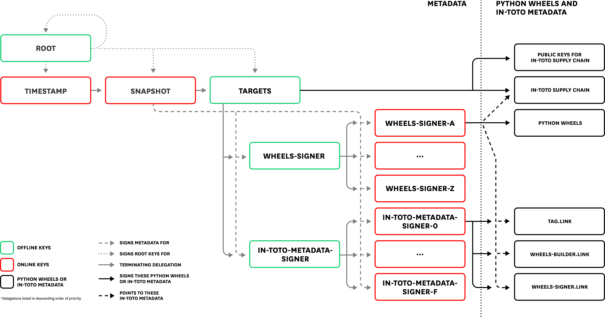
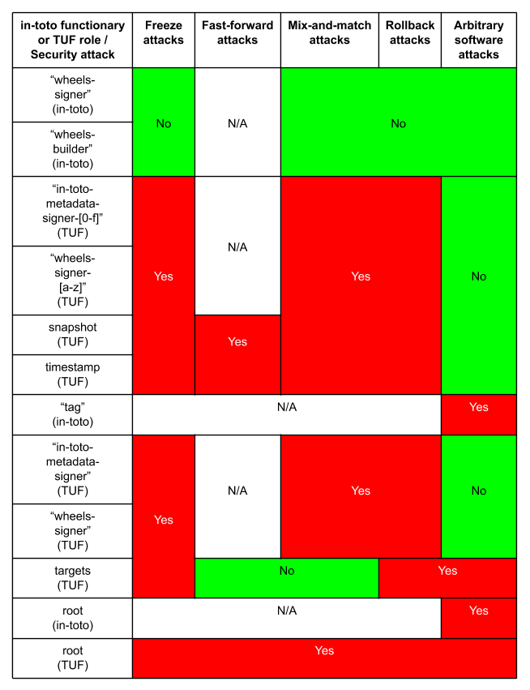

= ITE-3: Real-world example of combining TUF and in-toto for packaging Datadog Agent integrations
:source-highlighter: pygments
:toc: preamble
:toclevels: 5
ifdef::env-github[]
:tip-caption: :bulb:
:note-caption: :information_source:
:important-caption: :heavy_exclamation_mark:
:caution-caption: :fire:
:warning-caption: :warning:
endif::[]

.Metadata
[cols="2"]
|===
| ITE
| 3

| Title
| Real-world example of combining TUF and in-toto for packaging Datadog Agent integrations

| Sponsor
| link:https://github.com/trishankatdatadog[Trishank Karthik Kuppusamy]

| Status
| Accepted

| Type
| Informational

| Created
| 2019-07-19

|===

[[abstract]]
== Abstract

Datadog is a monitoring service for cloud-scale applications that monitor
servers, databases, tools, and services through a
software-as-a-service-based data analytics platform. It supports
multiple cloud service providers, including Amazon Web Services,
Microsoft Azure, Google Cloud Platform, and Red Hat OpenShift.

The Datadog https://docs.datadoghq.com/agent/?tab=agentv6[agent] is the
software that runs on virtual machines or containers. It collects events and
metrics from these virtual machines or containers and sends them to Datadog,
where customers can analyze their monitoring and performance data. The agent
https://docs.datadoghq.com/getting_started/integrations/[integrations]
is A plug-in that collects metrics from services running on customer
infrastructure. Presently, there are more than one hundred integrations, all of which
come out-of-the-box with the Agent installed.

This ITE discusses the TUF security model used to distribute the Datadog Agent
integrations in a compromise-resilient manner.

[[motivation-and-reasoning]]
== Motivation and reasoning

See
xref:../2/README.adoc#motivation-and-reasoning[ITE-2].

[[specification]]
== Specification

[[datadog-agent-integrations]]
=== Datadog Agent integrations

image:tuf-in-toto-figure-1.png[Figure 1]

*Figure 1*: The Datadog Agent integrations software supply chain.

The Datadog agent integrations supply chain, shown in Figure 1,
presently has three steps:

[arabic]
. The first "`tag`" step outputs Python source code as products. Every
integration consists of Python source code and several
https://yaml.org/[YAML] configuration files. The step uses (1, n)
Yubikeys, where n is the current number of Datadog Agent integration
developers. We use this threshold for usability, so that any developer
may release a new integration at any time. If a higher level of security
is desired, more than one developer keys may be required to release a new
integration.
(See this
https://dd-integrations-core-wheels-build-stable.datadoghq.com/targets/in-toto-metadata/3e592d47ab815cb9bd8aa064bbaa2a217c1baa9a55a7f8b73d2da6dfd14a247e/tag.c295cf63.link[example]
"`tag`" link metadata file.)
. In the second "`wheels-builder`" step, the pipeline must receive the
same source code from the "`tag`" step and produce a Python
https://pythonwheels.com/[wheel], as well as its updated Python metadata
(https://www.python.org/dev/peps/pep-0503/[simple indices]). Each wheel
is a ZIP file and its metadata is an HTML file that points to all the
available _versions_ of an integration. This step uses (1,1) online
keys. This threshold is used because using more than 1 online key does not
confer significant additional security.
(See this
https://dd-integrations-core-wheels-build-stable.datadoghq.com/targets/in-toto-metadata/3e592d47ab815cb9bd8aa064bbaa2a217c1baa9a55a7f8b73d2da6dfd14a247e/wheels-builder.9fc6e62d.link[example]
"`wheels-builder`" link metadata file.)
. In the third "`wheels-signer`" step, the pipeline must receive, as
materials, the same products as the "`wheels-builder`" step. This step
signs for all wheels using the TUF security model, which will be described
shortly. This step uses (1, 1) online keys. This threshold is used because
using more than 1 online key does not confer significant additional security.
(See this
https://dd-integrations-core-wheels-build-stable.datadoghq.com/targets/in-toto-metadata/3e592d47ab815cb9bd8aa064bbaa2a217c1baa9a55a7f8b73d2da6dfd14a247e/wheels-signer.20585de1.link[example]
"`wheels-signer`" link metadata file.)

Finally, there is an inspection which first ensures that a given wheel
matches the materials of the "`wheels-signer`" step. The inspection then
extracts files from the wheel and checks that they correspond to exactly the
same Python source code and YAML configuration files as the products of the
"`tag`" step. Thus, this root layout provides end-to-end verification: it
prevents a compromised pipeline from causing users to trust wheels with
source code that was never released by Datadog developers.
The root layout uses (2, 3) offline keys, and its metadata expires in 1 year.
Using a threshold of two keys to sign the root provides the benefits of the
two-man rule developed by the US Air Force, while a third key in the pool of
valid keys allows for redundancies in situations where a compromised key
must be revoked and replaced.
(See this
https://dd-integrations-core-wheels-build-stable.datadoghq.com/targets/in-toto-metadata/root.layout[example]
root layout metadata file.)

(The root layout also tracks previously built Python metadata and wheels, as
well as their corresponding in-toto link metadata files, as they move through
the CI/CD pipeline, but these are largely out of the scope of this document.)

*Figure 2*: The TUF security model that distributes in-toto metadata and
Datadog Agent integrations in a compromise-resilient manner.

The TUF security model, illustrated in Figure 2, is configured as
follows. It is discussed here using an "`inside-out,`" layered approach. A
key difference from the
<<../2/README.adoc#basic-security-model, basic security model>>
is that we use delegations extensively in order to split metadata
bandwidth costs.

The "`wheels-signer`" delegated targets role makes a terminating
delegation of all Python metadata and wheels for integrations beginning
with the letter "`a`" to the "`wheels-signer-a`" role, all Python
metadata and wheels for integrations beginning with the letter "`b`" to
the "`wheels-signer-b`" role, and so on until it finishes sending all Python metadata and
wheels for integrations beginning with the letter "`z`" to the
"`wheels-signer-z`" role. Thus, there are 26 of these roles, all of which 
use (2, 3) offline keys for the same reasons as the root layout, and do not
directly sign for any Python metadata or wheel. Metadata expires for these
wheels-signer roles expire in 1 year. The following is an excerpt of the
https://dd-integrations-core-wheels-build-stable.datadoghq.com/metadata.staged/wheels-signer.json[example]
metadata file:

.wheels-signer.json
[source,json]
----
{
  "signatures": {...},
  "signed": {
    ...,
    "delegations": {
      "keys": {...},
      "roles": [
        {
          "keyids": [
            "20585de1ca258adecd3ab82dac4c1a3f22866a926015d89c0e14ccc37d1577c5"
          ],
          "name": "wheels-signer-a",
          "paths": [
            "simple/index.html",
            "simple/datadog-a*/index.html",
            "simple/datadog-a*/datadog_a*-*-py2.py3-none-any.whl"
          ],
          "terminating": true,
          "threshold": 1
        },
        {
          "keyids": [
            "20585de1ca258adecd3ab82dac4c1a3f22866a926015d89c0e14ccc37d1577c5"
          ],
          "name": "wheels-signer-b",
          "paths": [
            "simple/datadog-b*/index.html",
            "simple/datadog-b*/datadog_b*-*-py2.py3-none-any.whl"
          ],
          "terminating": true,
          "threshold": 1
        },
        ...,
        {
          "keyids": [
            "20585de1ca258adecd3ab82dac4c1a3f22866a926015d89c0e14ccc37d1577c5"
          ],
          "name": "wheels-signer-z",
          "paths": [
            "simple/datadog-z*/index.html",
            "simple/datadog-z*/datadog_z*-*-py2.py3-none-any.whl"
          ],
          "terminating": true,
          "threshold": 1
        }
      ]
    }
    ...,
  }
}
----

Each "`wheels-signer-[a-z]`" role signs targets metadata about a certain
subset of Python metadata and wheels beginning with a particular letter.
Each Python wheel is associated with custom targets metadata that point
to all of the in-toto metadata required to verify that particular wheel,
as described in the
<<../2/README.adoc#basic-security-model, basic security model>>.
In particular, each directory containing in-toto link metadata
for one or more associated wheel is named directly using the SHA-256
hexadecimal digest of the "`tag`" link metadata file associated with
these wheels. Each role uses (1,1) online keys, does not delegate any
Python metadata or wheel, and its metadata expires in 1 week, which is
the maximum lifetime allowed for a release of a wheel.
This threshold is used because using more than 1 online key does not
confer significant additional security.
The following is
an excerpt of the
https://dd-integrations-core-wheels-build-stable.datadoghq.com/metadata.staged/wheels-signer-a.json[example]
metadata file:

.wheels-signer-a.json
[source,json]
----
{
  "signatures": {...},
  "signed": {
    ...,
    "targets": {
      "simple/datadog-active-directory/datadog_active_directory-1.2.0-py2.py3-none-any.whl": {
        "custom": {
          "in-toto": [
            "in-toto-metadata/root.layout",
            "in-toto-metadata/3e592d47ab815cb9bd8aa064bbaa2a217c1baa9a55a7f8b73d2da6dfd14a247e/wheels-signer.20585de1.link",
            "in-toto-metadata/3e592d47ab815cb9bd8aa064bbaa2a217c1baa9a55a7f8b73d2da6dfd14a247e/wheels-builder.9fc6e62d.link",
            "in-toto-metadata/3e592d47ab815cb9bd8aa064bbaa2a217c1baa9a55a7f8b73d2da6dfd14a247e/tag.c295cf63.link"
          ]
        },
        "hashes": {
          "sha256": "2e5e1e32070e9ef032af3345f9529f18a852f8c2019b286565175c65e0787327",
          "sha512": "c9c2a2185d1903c181587df5a4bc11d76e4d5ed33af0a2f254e6dbe2c9369b1cd70956718e1eb1f3ada78af3d1a37a1a8c068368687ab392c92becc32c2a7c58"
        },
        "length": 4524
      }
    }
    ...,
  }
}
----

The "`in-toto-metadata-signer`" delegated targets role makes a
terminating delegation of all in-toto link metadata in directories
beginning with the letter "`0`" to the "`in-toto-metadata-signer-0`"
role, all in-toto link metadata in directories beginning with the letter
"`1`" to the "`in-toto-metadata-signer-1`" role, and so on until all
in-toto link metadata in directories beginning with the letter "`f`" to
the "`in-toto-metadata-signer-f`" role. Thus, there are 16 of these
roles (since there are 16 hexadecimal characters in the SHA-256 digests
used to uniquely name these directories). This role uses (2, 3) offline
keys for the same reasons as the root layout, does not directly sign for
any in-toto link metadata file, and its metadata expires in 1 year.
The following is an excerpt of the
https://dd-integrations-core-wheels-build-stable.datadoghq.com/metadata.staged/in-toto-metadata-signer.json[example]
metadata file:

.in-toto-metadata-signer.json
[source,json]
----
{
  "signatures": {...},
  "signed": {
    ...,
    "delegations": {
      "keys": {...},
      "roles": [
        {
          "keyids": [
            "20585de1ca258adecd3ab82dac4c1a3f22866a926015d89c0e14ccc37d1577c5"
          ],
          "name": "in-toto-metadata-signer-0",
          "paths": [
            "in-toto-metadata/0*/*.link"
          ],
          "terminating": true,
          "threshold": 1
        },
        {
          "keyids": [
            "20585de1ca258adecd3ab82dac4c1a3f22866a926015d89c0e14ccc37d1577c5"
          ],
          "name": "in-toto-metadata-signer-1",
          "paths": [
            "in-toto-metadata/1*/*.link"
          ],
          "terminating": true,
          "threshold": 1
        },
        ...,
        {
          "keyids": [
            "20585de1ca258adecd3ab82dac4c1a3f22866a926015d89c0e14ccc37d1577c5"
          ],
          "name": "in-toto-metadata-signer-f",
          "paths": [
            "in-toto-metadata/f*/*.link"
          ],
          "terminating": true,
          "threshold": 1
        }
      ]
    }
    ...,
  }
}
----

Each "`in-toto-metadata-singer-[0-f]`" role signs targets metadata about
a certain subset of in-toto-link metadata files inside directories
beginning with a particular letter. Each role uses (1,1) online keys,
does not delegate any in-toto link metadata file, and its metadata
expires in 1 week, which is again based on the release lifetime.
This threshold is used because using more than 1 online key does not
confer significant additional security.
The following is an excerpt of the
https://dd-integrations-core-wheels-build-stable.datadoghq.com/metadata.staged/in-toto-metadata-signer-3.json[example]
metadata file:

.in-toto-metadata-signer-3.json
[source,json]
----
{
  "signatures": {...},
  "signed": {
    ...,
    "targets": {
      "in-toto-metadata/3e592d47ab815cb9bd8aa064bbaa2a217c1baa9a55a7f8b73d2da6dfd14a247e/tag.c295cf63.link": {
        "hashes": {
          "sha256": "3e592d47ab815cb9bd8aa064bbaa2a217c1baa9a55a7f8b73d2da6dfd14a247e",
          "sha512": "1f02d145705358732c06e9d0fc197a87563643aafb30407ff15f2ede07991ebee141adaf28ac05e1544184ba36d5b84bec202be73cad494848ff0c224a8b0d48"
        },
        "length": 118063
      },
      "in-toto-metadata/3e592d47ab815cb9bd8aa064bbaa2a217c1baa9a55a7f8b73d2da6dfd14a247e/wheels-builder.9fc6e62d.link": {
        "hashes": {
          "sha256": "502529aa88feafbdb6d7f61d99e5c677ae16a365ac0d4994b765a2e62044ece5",
          "sha512": "eaa849159f95f54af67a256301a9a90409e3e5c7826e6e052aa772fb8ad23c4a74e7a12448b6658b74654caa2c224ba356f0fc3dcf214f93bf354c6cc25ed63f"
        },
        "length": 195232
      },
      "in-toto-metadata/3e592d47ab815cb9bd8aa064bbaa2a217c1baa9a55a7f8b73d2da6dfd14a247e/wheels-signer.20585de1.link": {
        "hashes": {
          "sha256": "4ae4538b43047e1a44e65cc5cd27d0fd398abe86bdcc4d4bb2f2ea56dce237af",
          "sha512": "6bee61135531f3f77017266f86815acd2e6e57d5efa4767bc651f2ff7ad6ccb89d4c3357e6b9069a17c8d26aa48043096cbf79da191d751e9dfae46b7ab509d3"
        },
        "length": 41084
      }
    }
    ...,
  }
}
----

The targets role signs targets metadata about the in-toto root layout,
and all of the public keys used to verify the layout itself. It also
makes a terminating delegation of all Python metadata and wheels to the
"`wheels-signer`" role. Finally, it makes a terminating delegation of
all in-toto link metadata to the "`in-toto-metadata-signer`" role. It
uses a different set of (2, 3) offline keys from the in-toto root
layout to maintain the principle of separation of duties, but its
metadata also expires in 1 year. In addition, it shares
its keys with the "`wheels-signer`" and "`in-toto-metadata-signer`"
roles. The following is an excerpt of the
https://dd-integrations-core-wheels-build-stable.datadoghq.com/metadata.staged/targets.json[example]
metadata file:

.targets.json
[source,json]
----
{
  "signatures": {...},
  "signed": {
    ...,
    "delegations": {
      "keys": {...},
      "roles": [
        {
          "keyids": [
            "55ab70a7aa25265397ce6995a085d3ab57d7a9f25dc581f4ab52a9ca69e2045b",
            "e2cd3b1ab9e2f2c3b94be7a938b54cfe246ae2aa4bd8a89006fa083548b1cd2e",
            "aeec26293d275857dc46df87a2cf4ca14451d7226f6b99238af1df285a9a48c0"
          ],
          "name": "wheels-signer",
          "paths": [
            "simple/index.html",
            "simple/datadog-*/index.html",
            "simple/datadog-*/datadog_*-*-py2.py3-none-any.whl"
          ],
          "terminating": true,
          "threshold": 2
        },
        {
          "keyids": [
            "55ab70a7aa25265397ce6995a085d3ab57d7a9f25dc581f4ab52a9ca69e2045b",
            "e2cd3b1ab9e2f2c3b94be7a938b54cfe246ae2aa4bd8a89006fa083548b1cd2e",
            "aeec26293d275857dc46df87a2cf4ca14451d7226f6b99238af1df285a9a48c0"
          ],
          "name": "in-toto-metadata-signer",
          "paths": [
            "in-toto-metadata/*/*.link"
          ],
          "terminating": true,
          "threshold": 2
        }
      ]
    },
    "targets": {
      "in-toto-metadata/root.layout": {
        "custom": {
          "in-toto": [
            "in-toto-pubkeys/298f37401f0b526a708967b7f708bc9c938fe0ad4bfe50d66837c20a57084e84.pub",
            "in-toto-pubkeys/3e82bcdc71b29999340ceaadf3dc4193f8b06572d1c20612e9acdd7b52fa4b90.pub",
            "in-toto-pubkeys/e847f58ca5e83fc48d1d2388ddd8f1a168b205a3fe7978ad015dee3ae7b2ecf7.pub"
          ]
        },
        "hashes": {
          "sha256": "930c48fa182d14835febd6a7f9129e34b83246f74238b9747fef7fc12147184d",
          "sha512": "6fb781b534266411d0c424626b728b57e6c0a39b21798729efc63ff73556dfd19ebeddf7612da272936dad890d71b7e3caa65735ab6ac293740f2c5d29795590"
        },
        "length": 101047
      },
      "in-toto-pubkeys/298f37401f0b526a708967b7f708bc9c938fe0ad4bfe50d66837c20a57084e84.pub": {
        "hashes": {
          "sha256": "a19b11a130b35fb205e8cf8ab2f2488f387332be56857968785ce9899a521b05",
          "sha512": "b7e48526cdde5c879e710c9542b4cc6b36de91ed93d709d2f5be4ec45d719e77397f69b6b8c117826987418d334eb01e9d27b37874c66157b536a77035b44048"
        },
        "length": 799
      },
      "in-toto-pubkeys/3e82bcdc71b29999340ceaadf3dc4193f8b06572d1c20612e9acdd7b52fa4b90.pub": {
        "hashes": {
          "sha256": "3560de9da223ac51b5cdbf25acf9f8e8f9f7b699eeda912c7a26a68c5f01ce12",
          "sha512": "65aa1c2e7114714224142812bfc7bb8b2e6a37f54ebdbcbe20cc6e8f1504d73df17747a3ccc5acbdbefbe4df58065f88c72e4c4dac7e50c067c05b8b2ee25f4f"
        },
        "length": 799
      },
      "in-toto-pubkeys/e847f58ca5e83fc48d1d2388ddd8f1a168b205a3fe7978ad015dee3ae7b2ecf7.pub": {
        "hashes": {
          "sha256": "8cb4a254ae123a8bd91b1c9abdd99e719aa8349ff7eafd168988ce8a935d51a1",
          "sha512": "e259f98b766537ed2893c1b1e25d171d8ab374702f29d0fbe3708b13a4456e153b29e36722f136bc963e4a85fa7581dfbbf40ebd3e1538227ec30874264ddd2b"
        },
        "length": 799
      }
    },
    ...,
  }
}
----

All online roles ("`wheels-signer-[a-z]`",
"`in-toto-metadata-signer-[0-f]`", snapshot, and timestamp) share the
same (1, 1) online keys. (See these examples of the
https://dd-integrations-core-wheels-build-stable.datadoghq.com/metadata.staged/snapshot.json[snapshot]
and
https://dd-integrations-core-wheels-build-stable.datadoghq.com/metadata.staged/timestamp.json[timestamp]
metadata files.)

The root role uses a different set of (2, 3) offline keys from both the
in-toto root layout and the targets role, and its metadata expires in 1
year. Using different sets of (2, 3) offline keys provide the benefits
of the two-man rule while also clearly separating the duties of the root
role, the targets role, and the in-toto root layout.
(See this
https://dd-integrations-core-wheels-build-stable.datadoghq.com/metadata.staged/root.json[example]
the root metadata file.) All TUF metadata and targets are written using
https://github.com/theupdateframework/specification/blob/master/tuf-spec.md#7-consistent-snapshots[consistent
snapshots]. Figure 3 summarizes the security model discussed in this
subsection.

image:tuf-in-toto-figure-3.png[Figure 3]

*Figure 3*: A summary of the security model discussed in this subsection.

In summary, the Datadog pipeline uses TUF to bootstrap the
root of trust for the entire system, and in-toto to guarantee that
the pipeline packaged exactly the source code signed by one of the
Datadog developers inside universal Python wheels. By tightly
integrating TUF and in-toto, Datadog’s users obtain the
compromise-resilience of both systems combined.

[[workflows]]
=== Workflows

This subsection discusses the workflow followed by developers, the CI/CD
pipeline, and end-users for the
<<datadog-agent-integrations, Datadog Agent integrations>>.

==== Developer

Datadog developers sign integrations using Yubikeys, which support the on-card
generation and storage of GPG signing keys.

These keys offer three levels of protection:

[arabic]
. Assuming that the Yubikey firmware works correctly, private keys
cannot be exported outside of the card.
. Each Yubikey requires a secret user PIN to unlock the signing key.
. Every developer must touch the Yubikey to authorize any signing
operation.

The developers use a command-line tool which transparently
https://github.com/DataDog/integrations-core/blob/master/datadog_checks_dev/datadog_checks/dev/tooling/signing.py[calls]
in-toto, which in turn calls GPG, to sign integrations. Thus, using
Yubikeys, we are able to significantly minimize the risk of a key
compromise without hampering usability.

==== CI/CD

When developers merge source code for new and / or updated integrations
into the GitHub
https://github.com/DataDog/integrations-core[repository], the internal
CI/CD pipeline is triggered, which consists of the following steps:

[arabic]
. Fetch source code from the GitHub repository corresponding to these
integrations. Also fetch previously built Python metadata and wheels.
. Record this source code and previously built Python metadata and
wheels as materials for the "`wheels-builder`" step. Build Python
metadata and wheels for these integrations. Record all old and new
Python metadata and wheels as products of the "`wheels-builder`" step.
. Fetch previously signed TUF and in-toto metadata.
. Record all old and new Python metadata and wheels as materials for the
"`wheels-signer`" step. Verify all previously signed TUF and in-toto
metadata, as well as previously built Python metadata and wheels. Produce
a new consistent snapshot of TUF metadata for all Python metadata and
wheels, as well as in-toto link metadata. Record no products for the
"`wheels-signer`" step.
. Test that the Datadog agent is able to download and verify with TUF
and in-toto the latest wheel for every integration, as described in the next
subsection.
. Perform garbage collection of expired consistent snapshots of TUF
metadata.
. Upload the latest consistent snapshot of TUF metadata, new Python
metadata as well as wheels, and new in-toto link metadata to the
repository.

==== End-users

Finally, to install or update integrations, customers use the Datadog
agent, which transparently
https://github.com/DataDog/integrations-core/tree/master/datadog_checks_downloader[calls]
TUF and in-toto libraries on their behalf. The download and verification
workflow is roughly as follows:

[arabic]
. Use TUF to download and verify the wheel for a given integration name
and version number.
. Use TUF to download and verify the in-toto metadata for the given
wheel.
. Use TUF to download and verify public keys for the in-toto root
layout.
. Use in-toto to verify that the given wheel matches the rules specified
in the in-toto root layout.
. If all of the above checks pass, return the wheel to the Datadog
agent.

Customers see no difference in their experience, unless an attack is
caught by TUF or in-toto. In that case, installation of the integration
will be denied, and users will see an error message indicating why TUF
or in-toto failed to verify the wheel.

=== Deployment considerations

Deployment considerations, such as designing and securely performing the
offline key generation and rotation ceremony, are discussed in a
separate document.

[[security]]
== Security

Figure 4 presents a detailed security analysis for
<<datadog-agent-integrations, Datadog agent integrations>>, featuring
only the most significant security attacks.

*Figure 4*: A security analysis showing which security attacks are
possible for Datadog agent integrations, depending on which in-toto
functionary or TUF role keys are compromised. in-toto functionaries and
TUF roles are listed as rows in increasing order of difficulty to
compromise. Security attacks are listed as columns in increasing order
of severity. The result of combining two or more functionaries / roles
is that "`Yes`" overrides "`No`" or "`N/A`".

[[infrastructure-requirements]]
== Infrastructure requirements

See
xref:../2/README.adoc#infrastructure-requirements[ITE-2].

[[backwards-compatibility]]
== Backwards compatibility

See
xref:../2/README.adoc#backwards-incompatibility[ITE-2].

[[testing]]
== Testing

N/A.

[[references]]
== References

[arabic]
. xref:../2.adoc[ITE-2]
. https://www.datadoghq.com/blog/engineering/secure-publication-of-datadog-agent-integrations-with-tuf-and-in-toto/[Secure
Publication of Datadog Agent Integrations with TUF and in-toto]
. https://youtu.be/XAlvd4QXngs[Deep Dive: TUF at Kubecon North America
2018]
. https://www.usenix.org/conference/usenixsecurity19/presentation/torres-arias[in-toto:
providing farm-to-table security properties for bits and bytes]
